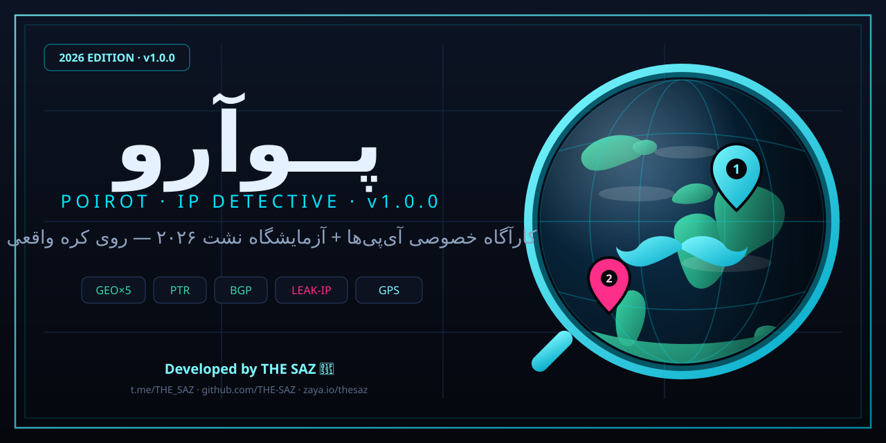

  
  
  
  

<h3 align="center">🌐 <a href="README.md">English</a> · <a href="README.fa.md">فارسی</a> · <a href="README.ru.md">Русский</a></h3>

# 🔎 Poirot — IP Detective v1.0.1

Full-spectrum IP intelligence console + **LEAK IP 2026 lab** on a **real rotating globe** (MapLibre GL globe + CARTO/OSM/Esri tiles, with automatic Leaflet fallback). **Bug-free, production-ready.**

## 🐞 Fixed in v1.0.1
- Globe **no longer keeps spinning after scan** — rotation auto-pauses on scan/marker select; resume with 🌀.
- **Pin drop animation + country flag** now render on every located IP (was invisible before).
- Fixed `ReferenceError` in history selection, blank screenshot (`preserveDrawingBuffer`), RTL timeline glitch, dead typography sliders.

## ✨ Features
- **Geo consensus** from 5 parallel sources + error radius + agreement %
- **Network identity**: ISP/Org/ASN + live BGP prefix + reverse PTR (DoH)
- **Security**: Tor exit, proxy, VPN, hosting flags
- **LEAK LAB**: WebRTC public/LAN, timezone, language, DNS resolver path, precise GPS leak → protection score + JSON export
- **Globe**: numbered flag-pins with drop animation, GPS pin, great-circle arcs, satellite style, fullscreen, screenshot
- **Archive**: search, time/confidence/tag filters, timeline, tags, JSON/CSV/**KML** export, import
- **Compare** two cases side-by-side · Share URL · PWA notifications · keyboard shortcuts
- **Settings**: 3 languages (FA/EN/RU), dark/light/auto theme, 6 accents, font-size & corner-radius, sounds, privacy mode, scan engine tuning

## 🚀 Deploy
Upload → Settings → Pages → Branch: main → Save. Local: `python -m http.server 8080`

## 👨‍💻 Developed by THE SAZ 🔱

<a href="https://t.me/THE_SAZ">Telegram</a> • <a href="https://github.com/THE-SAZ">GitHub</a> • <a href="https://zaya.io/thesaz">Website</a>

## 📜 MIT — see [LICENSE](LICENSE)
